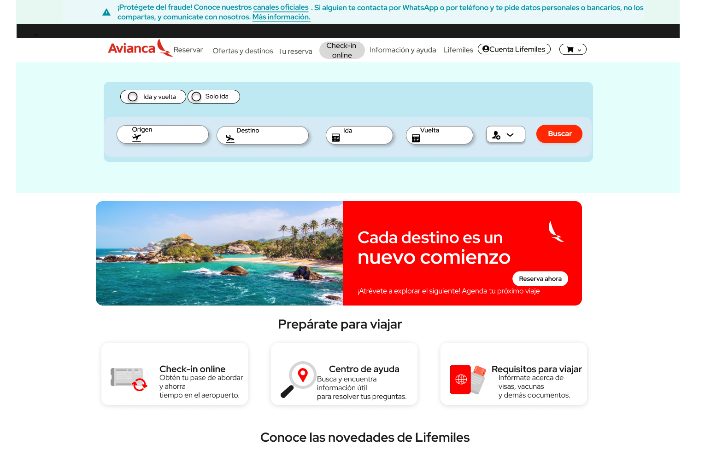
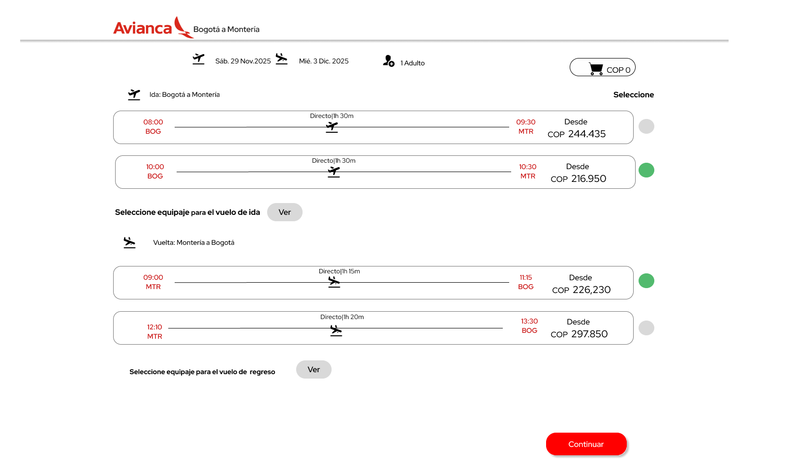
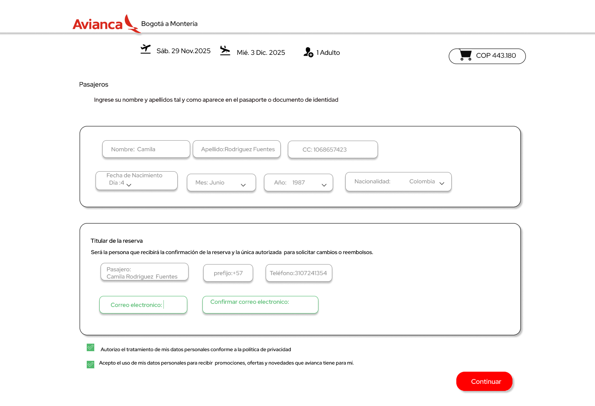
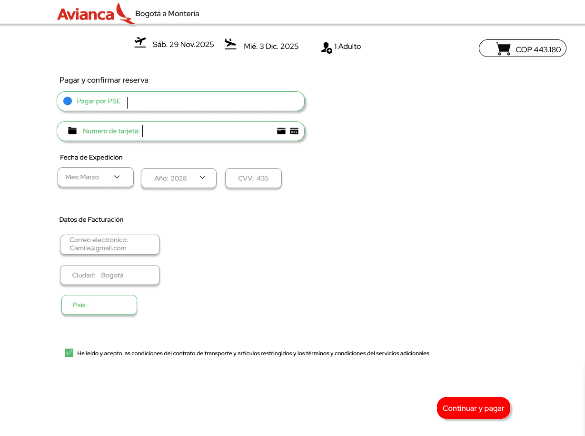
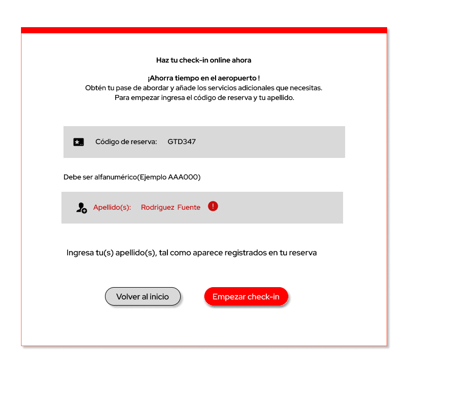
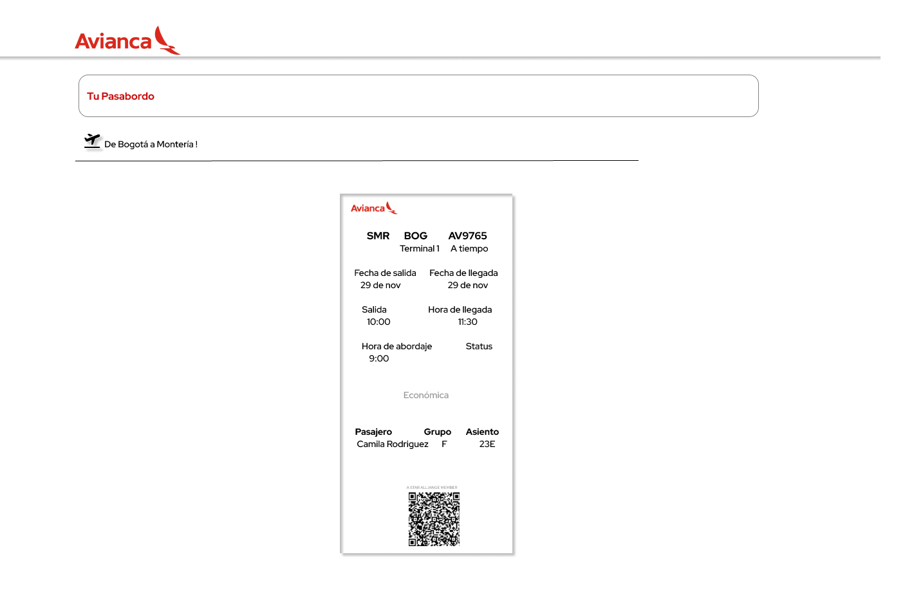

#  Rediseño UX/UI — Avianca

  

---

##  Autora  
**Deisy Esther Esquivia Pérez**  
Diseñadora UX/UI · Fullstack Developer  

🔗 LinkedIn: https://www.linkedin.com/in/deisy-esquivia-fullstack-devolper/  
🔗 GitHub: https://github.com/deissy03  

---

##  Descripción del proyecto

Este proyecto consiste en el **rediseño UX/UI de la plataforma web de Avianca**, enfocado en mejorar la experiencia de usuario en dos flujos críticos:

- Compra de tiquetes (ida y vuelta)  
- Check-in online  

El objetivo fue reducir fricción, mejorar la claridad visual, optimizar la arquitectura de información y aumentar la confianza del usuario.

---

## Problema identificado

- Procesos extensos y poco claros en la compra de tiquetes  
- Dificultad para comparar tarifas y servicios  
- Experiencia poco intuitiva en el flujo de check-in  
- Sobrecarga de información en pantallas clave  

---

##  Solución propuesta

Se realizó un rediseño completo UX/UI aplicando investigación, arquitectura de información y prototipado en Figma para:

- Reducir pasos innecesarios  
- Mejorar la claridad visual  
- Facilitar la toma de decisiones  
- Modernizar la experiencia de usuario  

---

##  Proceso UX aplicado

- Investigación cualitativa y cuantitativa  
- Benchmark competitivo  
- Análisis heurístico (Nielsen)  
- Encuestas y hallazgos de usuarios  
- User Persona  
- Journey Map  
- Lean UX Canvas  
- Arquitectura de información  
- Tree testing  
- Wireflows y taskflows  
- Wireframes de baja y alta fidelidad  
- Prototipado en Figma  
- Design System (Atomic Design)  
- Motion UI  
- Testeo de usabilidad  

---
## Resultados del testeo

- 100% de usuarios completaron las tareas sin bloqueos  
- Mayor claridad en el flujo de compra  
- Experiencia de check-in mejor evaluada  
- Mejora en percepción de confianza y rapidez  

---

##  Entregables

- Documento completo de rediseño (`rediseño-final.pdf`)  
- Prototipo en Figma (enlace dentro del documento)  
- Wireframes y arquitectura UX  
- Design System  
- Testeo de usabilidad  

---

##  Evidencia visual

### Home original

### vuelo

### formulario

### pagos

### Check-in

### pasabordos 

---

##  Licencia

Proyecto académico con fines educativos y de portafolio.

---

##  Agradecimientos

A Coderhouse, al profesor Alan Figueroa y a la tutora Belén Díaz por la guía durante el proceso.

